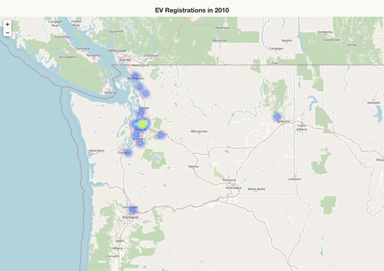
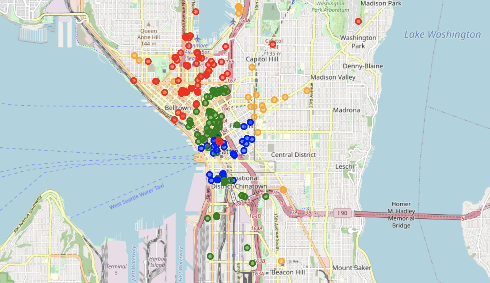
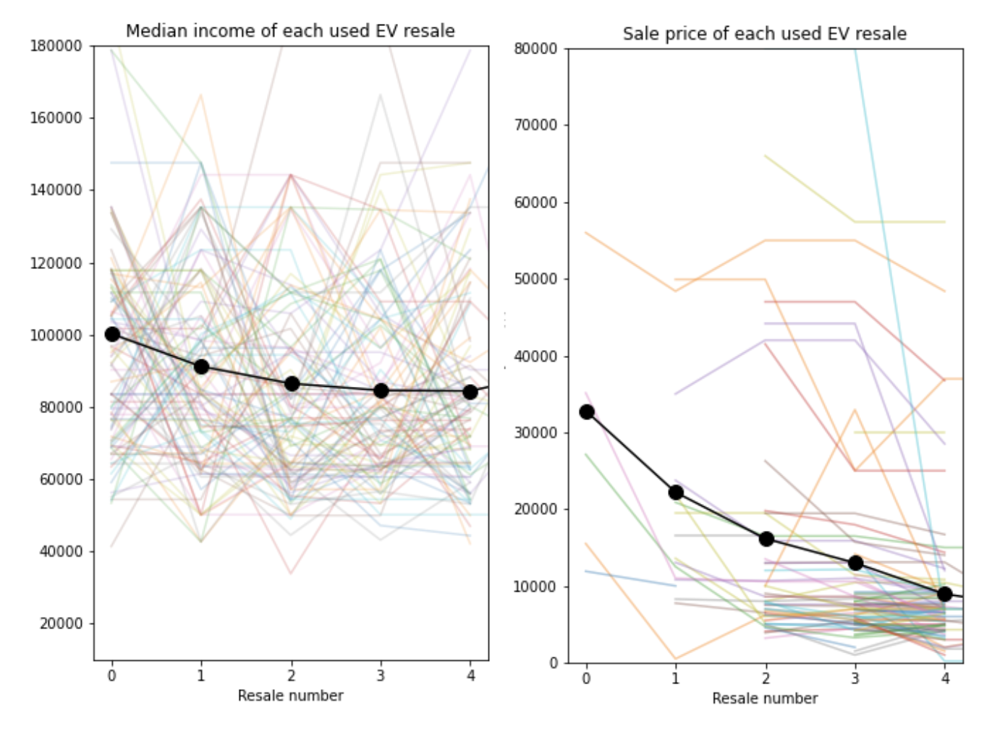

# Electric Vehicles: Access and Opportunity

<p style="text-align: center"></p>
<p style="text-align: center"><em>Electric vehicle registration in WA state from 2010 through 2021.</em></p>

## Introduction
Electric vehicles made up only 2.6% of global car sales in 2019, but this constituted a whopping [40% year-on-year increase](https://www.iea.org/reports/global-ev-outlook-2020). Consumers are interested in the greatly reduced fueling costs, minimal parts and maintenance, reduced carbon emissions, and exhilarating acceleration and power. Rebates and incentives upon purchase or lease also result in cost-savings. The big 3 US automakers (GM, Ford, Chrysler) have all made announcements promising only zero-emission car sales by approximately [2035](https://www.nytimes.com/2021/01/29/business/general-motors-electric-cars.html), and a record number of almost 100 pure electric EV models is set to debut by the end of [2024](https://www.consumerreports.org/hybrids-evs/why-electric-cars-may-soon-flood-the-us-market/). The market is responding to demand, and so are lawmakers.

On April 16, 2021, the Washington state legislature [passed](https://www.autoweek.com/news/green-cars/a36146281/washington-to-ban-gas-cars/#:~:text=The%20Washington%20state%20legislature%20has,the%20exception%20of%20emergency%20vehicles.) the Clean Cars 2030 bill, which will require that by 2030, all new light-duty vehicles sold or registered in the state be electric, with the exception of emergency vehicles. The bill outlines a transition period and calls for a number of impact studies to be completed before 2030, including an analysis centered on "equity, especially including disadvantaged and low-income communities, communities of color, and rural communities, and strategies for maximizing equity in implementation of the 2030 requirement," among other research.

In this work, we initiate a study that explores 3 areas:
1. The relationship between electric vehicle ownership and economic means:

  *What is the difference in ownership growth rate and access to charging facilities between higher and lower income owners?*

2. Access to charging facilities and the concept of 'garage orphan':

  *What is the difference in availability of single-family vs multi-unit housing in Seattle?*

3. Statewide network of charging stations:

  *How much improvement in charging facilities is required to make long-distance drives more feasible for an EV?*

We also discuss an opportunity for business owners [(explore Streamlit app)](https://evstreamlit.herokuapp.com/).

<p style="text-align: center"></p>

<p style="text-align: center"><em>Charging stations in downtown Seattle, clustered by population and median income.</em></p>

Sources:
1. [Clean Cars 2030 passed by WA legislature](https://www.autoweek.com/news/green-cars/a36146281/washington-to-ban-gas-cars/#:~:text=The%20Washington%20state%20legislature%20has,the%20exception%20of%20emergency%20vehicles.)
2. [Clean Cars 2030](https://www.autoweek.com/news/green-cars/a35616508/washington-state-bill-ev-only-sales-by-2030/)
3. [Removing Barriers to Electric Vehicle
Adoption by Increasing Access to
Charging Infrastructure](http://www.seattle.gov/Documents/Departments/OSE/FINAL%20REPORT_Removing%20Barriers%20to%20EV%20Adoption_TO%20POST.pdf)
4. [Seattle city household and family survey](https://www.census.gov/acs/www/data/data-tables-and-tools/narrative-profiles/2018/report.php?geotype=place&state=53&place=63000)
5. [Update on electric vehicle costs in the US through 2030](https://theicct.org/sites/default/files/publications/EV_cost_2020_2030_20190401.pdf)

## Data Description
* EV Registration: records of title activity (transactions recording changes of ownership), and registration activity (transactions authorizing vehicles to be used on Washington public roads). Data includes transactions completed January 2010 through February 2021. [(Source)](https://data.wa.gov/Transportation/Electric-Vehicle-Title-and-Registration-Activity/rpr4-cgyd)
* Population data: WA state population from 2019 [(source)](https://data.census.gov/cedsci/table?q=demographics&g=0400000US53,53.860000&tid=ACSDP5Y2019.DP05&hidePreview=true)
* Income data: WA state median income from 2019 [(source)](https://data.census.gov/cedsci/table?q=income&g=0400000US53,53.860000&tid=ACSST5Y2019.S1903&hidePreview=true)
* Representative profiles of time series charging data from public domain stations (in Palo Alto), a workplace (JPL in California), and some homes (in the MidWest).
  1. Publicly accessible charging stations: [City of Palo Alto](https://data.cityofpaloalto.org/datasets/176684/electric-vehicle-charging-station-usage-fy-2011-fy-2017/)
  2. Workplace charging data: ACN = [Adaptive Charging Network](https://ev.caltech.edu/info)
  3. Charging at home: [NREL](https://data.nrel.gov/submissions/69)
* Housing permits: Seattle data [since 2010](https://data-seattlecitygis.opendata.arcgis.com/datasets/b15bb712fa0a4f4c9862a78e6d7da513_0?geometry=-122.945%2C47.534%2C-121.715%2C47.696)
* Charging stations in WA extracted from charging stations in all of the US [(Source)](https://afdc.energy.gov/fuels/electricity_locations.html#/find/nearest?fuel=ELEC)

Data dictionaries for each dataset are referenced from the original data sites.

## Data Analysis
The following observations were gathered from analysis of data on EV ownership, charging cycles, geographical charging station distribution, housing permits, and WA state population and income:
* EV registrations have been increasing over the last 10 years, though registrations for 2020 dropped down, presumably due to Covid-19
* The rate of increase in battery electric vehicle (BEV) sales outpaces that of plugin-hybrid electric vehicle (PHEV) sales. In fact, the drop in overall EV sales in the past couple of years is due to a drop in PHEV EV_sales
* The EV median price of \$35,000 is ~1.5X the [average price of a gas vehicle (\$21,000)](https://theicct.org/sites/default/files/publications/EV_cost_2020_2030_20190401.pdf)
* 72.8% of EV registrations in WA state were carried out in zip codes with median income above the state median income
* For both above- and below-median income groups, BEV ownership constitutes a higher percentage of total EV ownership
* Ownership growth is 3 times faster among owners in above-median zipcodes compared to below-median zipcodes, though ownership continues to grow there too. This is a promising trend
* With each resale, the EV goes from higher to lower median income zipcodes, and from higher to lower sale price (figure below). This bodes well for increased accessibility (price-wise), because EVs generally have lower maintenance costs due to much fewer moving parts, though battery longevity issues will start to arise

<p style="text-align: center"></p>

<p style="text-align: center"><em>Income (left) and price (right) of used EVs.</em></p>

* From 3 datasets on charging cycles:
  * Charging at home occurs in the evening
  * Charging at work peaks in the morning only on weekdays
  * Usage of publicly accessible charging stations peak in the morning, at lunchtime, and at dinnertime, for both weekdays and weekends
* Housing lot sizes DO NOT follow Benford's law
* Since 2010, more non-single-family type homes (70%) are being constructed compared to single family homes, as these tend to be cheaper. But these homes also typically do not have easy access to power for the parked EV. Thought and effort need to be given to expanded and equitable access to vehicle charging across economic demographics
* Charging station network distribution lags behind EV-advanced countries such as Norway and China

## Modeling
Time series models were used to forecast EV sales 15 years into the future, as well as charging times for workplace-based charging stations. The models implemented were ARIMA, SARIMA and Facebook's Prophet.

K-Means clustering was applied to household charging data as well as population and income data, as relates to EV charging station distribution. Clustering was also carried out using objective numerical measures of distance.

## Conclusions
We find that 73% of electric vehicles (EVs) in WA state are owned in zipcodes with median income higher than the state median income. Growth in EV ownership the higher income zipcodes occurs at a rate 3X faster. There is not a strong relationship between charger density and median income (correlation of 0.14). The average charger density is 1.2 per 10k people, compared to Norway with [35 per 10k people](https://asia.nikkei.com/Spotlight/Datawatch/Japan-trails-Norway-and-France-in-EV-charging-stations-per-capita#:~:text=In%20Norway%2C%20where%2054%25%20of,35%20chargers%20per%2010%2C000%20people.). The highest density however is in the lower income zipcodes, which is promising. Over the last 10 years, 72% of housing permits in Seattle have been for non-single-family-housing, which is great for home ownership but underscores the need for equitable access to charging facilities across economic means. Large swathes of the state lack a well-connected charging station network, feeding into owners' range anxiety. The 300-mile distance from Seattle to Spokane would optimally have 10 charging station hubs, but currently only have 7.

## Recommendations
1. Increase incentives relative to income (currently state tax exemptions).
2. Legislate charging station requirements for housing developments.
3. Encourage businesses to install charging stations (incentives). Use the [custom app](https://evstreamlit.herokuapp.com/) to evaluate availability of nearby stations.

## APPENDIX

### 1. Repository Contents

### 1.1. Code
#### A. Notebooks
Use ```github1s.com``` to view interactive folium maps in Jupyter notebooks. Just add ```1s``` after ```github``` and press Enter in the browser address bar.

* 01 EV Ownership: explore the trends behind EV ownership in WA state
* 02 EV Income: explore the relationship between EV ownership and median income as a marker of economic means
* 03 EV Charging: explore charging behavior as well as access to home-based charging facilities
* 04 EV Stations: look at how public charging stations are distributed geographically

### 1.2. Data
Contains original data files, modified data files, combined data files, and saved models.

#### B. Python scripts
Python scripts contain custom functions and streamlit code.

### 1.3. Images
Figures for README and presentation.

### 2. Software Requirements
The following python libraries are required to run the notebooks: numpy, pandas, re, pickle, seaborn, matplotlib, branca, folium, json, requests, datetime, time, pytz, geopy, scikit-learn, statsmodels, prophet, IPython, selenium, time, os, PIL. Also the custom library libfunctions contained in the Code folder.
